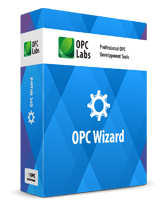

# OPC Wizard
<a href="https://www.opclabs.com/products/opc-wizard"></a>
- NuGet package: [**OpcLabs.OpcWizard**](https://www.nuget.org/packages/OpcLabs.OpcWizard)

OPC Wizard is a suite of OPC Server development components for .NET. These 
components are for *OPC Unified Architecture* (Client-Server) specification.

Note: For OPC client or subscriber development, see [QuickOPC](https://www.opclabs.com/products/quickopc).

OPC Wizard is a commercially licensed product. Without a license key, it runs
in a trial mode. The trial provides valid data to from the server for 30 
minutes; after that period, the component (your app) needs to be re-started, 
and so on. You must also comply with licensing terms for 3rd-party material 
redistributed with QuickOPC. For details, see the documentation.

Remember that NuGet packages are primarily a tool for resolving build-time 
dependencies. The amount of functionality that you get through OPC Wizard 
NuGet packages is smaller than what OPC Wizard can actually do for you. If 
you want a full coverage of the features, you would be better off downloading 
the Setup program from [OPC Labs Web site](https://www.opclabs.com). Further 
below you will find a list of differences between the two distribution forms.

OPC Wizard requires **.NET Framework** 4.7.2 or **.NET** 8.0 as a minimum. Under 
.NET 8.0+, it is supported on **Microsoft Windows**. 

PLEASE DO NOT USE PRE-RELEASE PACKAGES UNLESS INSTRUCTED TO DO SO.

Need help, tech support, or missing some example? Ask us for it on our [Online Forums](https://www.opclabs.com/forum/index)!
You do not have to own a commercial license in order to use Online Forums, 
and we reply to every post.

Follow us on [X (Twitter)](https://x.com/opclabs) | Follow us on [LinkedIn](https://linkedin.com/company/opc-labs)

List of available NuGet packages
--------------------------------
- **OpcLabs.OpcWizard**: OPC server components for all environments and 
project types.

- **OpcLabs.ConnectivityStudio.Sample.CS**: Console-based OPC Wizard and QuickOPC 
examples in C# (source code).
- **OpcLabs.ConnectivityStudio.Sample.VB**: Console-based OPC Wizard and QuickOPC 
examples in VB.NET (source code).
  
What is included in the NuGet packages
--------------------------------------
- Runtime assemblies for all programming models.
- NuGet: IntelliSense support (XML comments).

What is only available from the [Setup program](https://www.opclabs.com/download)
---------------------------------------------
- Visual Studio integration.
- Complete set of Examples and Demo applications, bonus material.
- Various tools.

What is only available from the [Setup program](https://www.opclabs.com/download) or the Web site
-------------------------------------------------------------
[Knowledge Base link - Tool Downloads](https://kb.opclabs.com/Tool_Downloads)
- Various tools, such as Connectivity Explorer, Launcher, OPC UA Demo Publisher, OpcCmd Utility, UA Configuration Tool.
- License Manager (GUI or console-based) utility.

How to start
------------
If you do not mind reading the documentation: [Getting Started with OPC Wizard](
https://opclabs.doc-that.com/files/onlinedocs/OPCLabs-ConnectivityStudio/Latest/User%27s%20Guide%20and%20Reference-OPC%20Studio/webframe.html#Getting%20Started%20with%20OPC%20Wizard.html).
Or, the whole [User's Guide](https://www.opclabs.com/documentation).

Otherwise, just instantiate the `OpcLabs.EasyOpc.UA.EasyUAServer` object (for 
OPC UA Server development) and explore its methods.

Example code
------------
C#:
```csharp
using OpcLabs.EasyOpc.UA;
...

using (var server = new EasyUAServer()
{
    server.Start();
    Console.ReadLine();
}
```

Examples on GitHub
------------------
As opposed to the sample NuGet packages, the examples on GitHub also include 
Web, Windows Forms, Windows Service and WPF projects.

- In C#: https://github.com/OPCLabs/Examples-ConnectivityStudio-CSharp.
- In VB.NET: https://github.com/OPCLabs/Examples-ConnectivityStudio-VBNET.

***
